# Workation in the Alps

Workation in the Alps is a website that wants to offer the possibility for remote workers and entire teams to have all the infrastructure needed to work and at the same this to relax, find the balance and let creativity flowing. Starting from the home page of the Work in the Alps site users have the possibility to understand the concept of the workation village and get some visual impressions about the place. At any time the users can switch to other pages to get more information about the coworking od workshops offer or switch directly to the booking form.

The site can be reached by this <a href="https://nadiakra.github.io/workation-in-the-alps/" target="_blank">link.</a> 

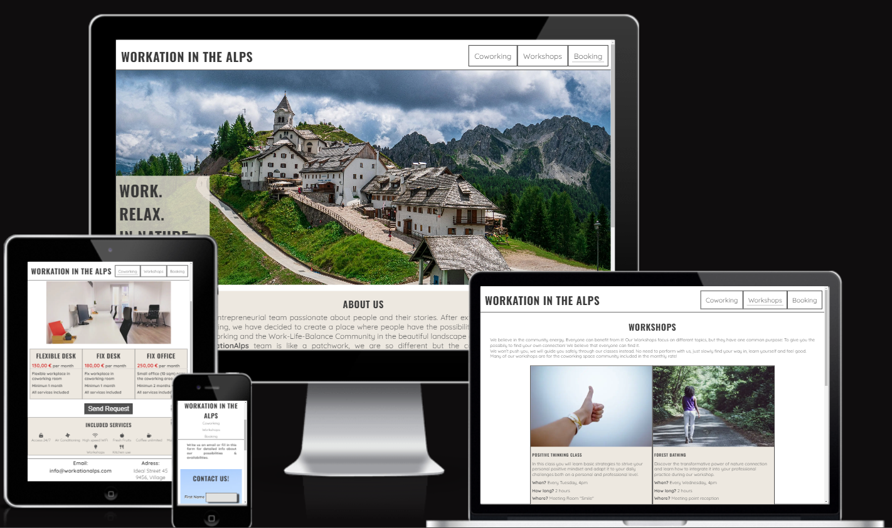

## User Stories

### First Time Visitor Goals
- As a First Time Visitor, I want to easily understand the main purpose of the site and learn more about the company and offered packages.
- As a First Time Visitor, I want to have easy access to the content and through a well-structured site.
- As a First Time Visitor, I want to see images of the location to have a visual overview about the place.

### Returning Visitor Goals
- As a Returning Visitor, I want to see information about workshops and coworking packages offered.
- As a Returning Visitor, I want to get more details about the single products.
- As a Returnig Visitor, I want to have a possibility to get in contact with the company to send a request for a coworking place or workshop.

### Frequent Visitor Goals
- As a Frequent Visitor, I want to have the possibility to ask particular questions regarding coworking and workshops.
- As a Frequent Visitor, I want to see if there are changes in the offered packages.

## Features 

The website "Workaktion in the Alps" has multiple features, in this section I provide an overview about each feature and its fuctionality. The two features "Navigation Bar" and "Footer" look the same way on all the pages. The site has 4 main pages: Home page, Coworking page, Workshops page and the Booking page. With this 4 pages structure the user has the possibility to gain directly from the first landing paage all the information about what kind of information and action possibilities the website is providing. 
The last page called "Response" contains the response message, that user receive once sending the request form.

### Existing Features

- __Navigation Bar__

  - Features the pages "Home", "Coworking", "Workshops" and "Booking", the full responsive navigation bar includes links to the logo and to every single page.
  - This sections provides the user the possibility to change the page without the need to go back to the home page and to filter interesting information.
  - "Home" was added to the NavBar in a second moment to improve user experience, as otherwise user would not know how to come back to the home page while navigating in one of the other pages.
  - The first image shows the NavBar for small screens and the second the NavBar for larger screens from 768px.

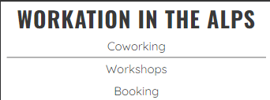 

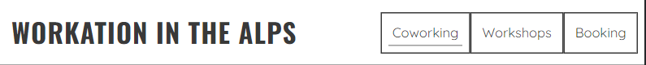 

- __Home page image__

  - The home page image is the workation village and will include also the claim "Work. Relax. In Nature" to communicate in a few words the philosopy of this place.
  - The user will have the possibliity to have the most of the image element as the claim box adapts the dimenson when screens become larger.
  - This section should give the user a visual impression of the village and its uniqueness combination of work and nature. The goal is to gain the interest of the user, who wants at this point more information.

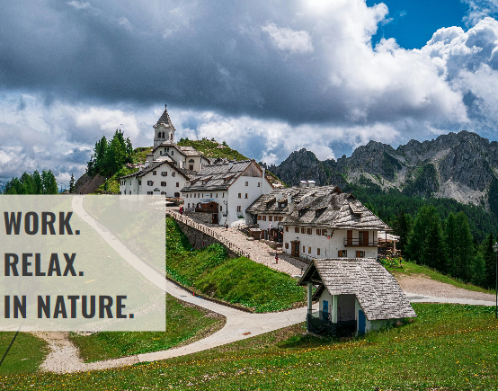

- __About us Section__

  - The About Us section will provide information about the background and the story behind the the concept of Workation in the Alps. 
  - The user will gain from the first moment the sense of community that should convice the user to choose this village as the next remote working place.  

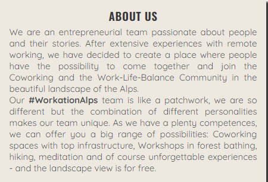

- __Gallery Section__

  - This section will highlight with pictures want the user has to aspect on site if booking. The attractive images should give a positive feeling to the user.
  - The pictures are fully responsive and it is planned to change them regularly at least twice a year to have seasonal relevant pictures.
  - The heading is not visible thanks to the display-none property in css, but reachable for seo reasons.

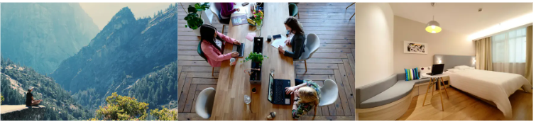

- __The Footer__ 

  - The footer section will include the email contact information, the adress and the relevant social media links. All the links will open to a new tab to allow easy navigation for the user. 
  - The user gains in this section all the valuable information to get in touch and find the geographical position of the village and to stay in touch through social media. 
  - The footer will have a top-border to visualise the end of the main content.

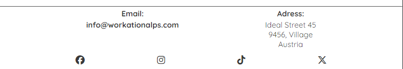

- __Coworking Page__

  - In this page the user will gain an overview about the prices and packages as well as the services included.
  - The image is an important element as the user can visualize how the working place looks like.
  - The user will quickly understand the information provided thanks to the simple page structure and will have the possibility to send directly a request. The send request button will bring the user directly to the booking form page.

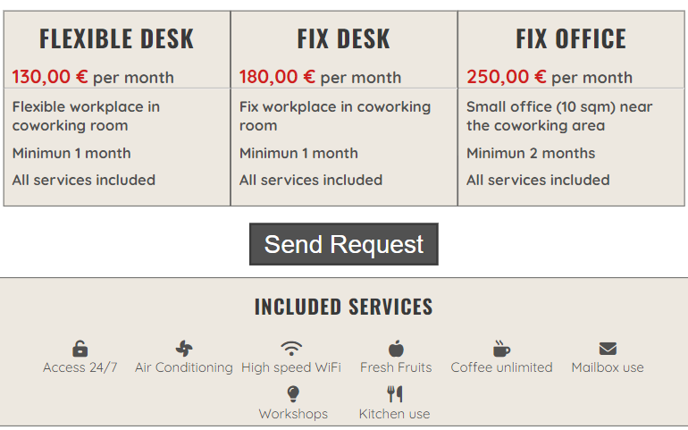

- __Workshops Page__

  - In this page the user will see the offered workshop classes and will gain an overview about how they are structured.
  - After each workshop description the user will have the possibility to click on the request button that redirects to the booking page.
  - The user will have all information in a simple structured form.

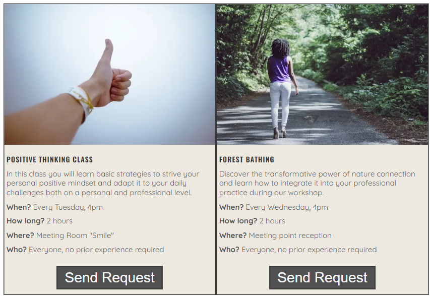

- __Booking Page__

  - This page will allow the user to send general requests. The user will be able specify if interested in "Coworking" or "Workshops" or both. The user will be asked to submit at least the full name, an email adress and a text regarding the request. 
  - Placeholder text will guide the user to fill the form correctly and avoid missunderstandings.

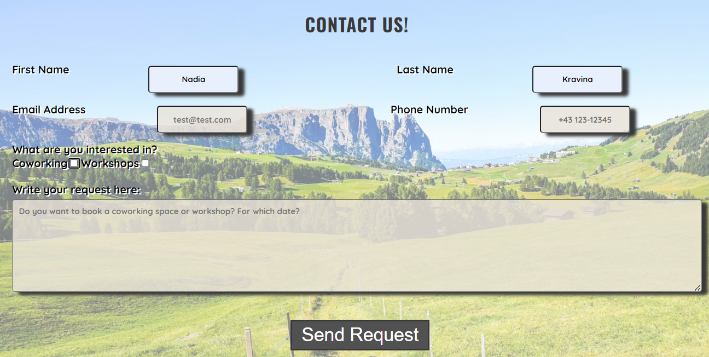

- __Response Page__

  - This page appears after submitting the contact form. 
  - The user receives a thank you for submitting message with the advice that the team will come back to the request as soon as possible.

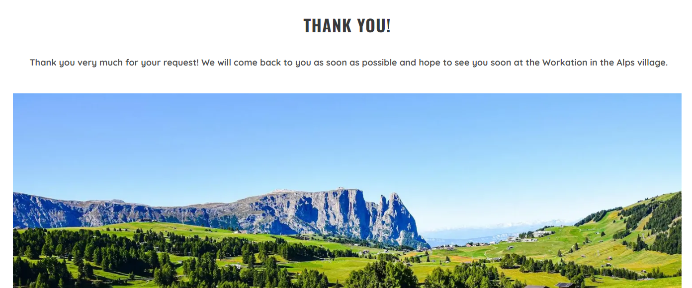

### Features Left to Implement

- To make the main page more attractive the next implementation will be a video instead of the static picture to add value to the first impression.
- The Booking Page will have in the next implementation date fields in order to give the user the possibility to add directly the wished period of stay. 

## Design
### Colour Scheme

The design used is based on neutral colours. As the site includes many images with different colour paths the user's attention should not be losed by a colour overload. 

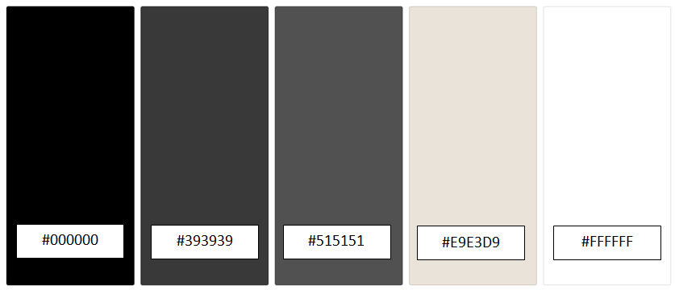

- HEX colours #393939, #515151 and #000000 are used for text design
- HEX colours #FFFFFF and #E9E3D9 are used for backgrounds. #E9E3D9 is used in the RBGA form with its transparency property.

### Typhography

To select the font the platform <a href="https://www.fontpair.co/all" target="_blank">Fontpair</a> was consulted.

- Oswald Google Font was used to make headings catchy and increase the attractiveness of the site.
- Quicksand Google Font was used as the main font of the site to assure the easy readibility of the content in the site.

## Technology Used

- <a href="https://developer.mozilla.org/en-US/docs/Web/HTML" target="_blank">HTML</a> was used as the base of the site.
- <a href="https://developer.mozilla.org/en-US/docs/Web/CSS" target="_blank">CSS</a> was used to style and add layouts to the site.
- <a href="https://developer.mozilla.org/en-US/docs/Learn/CSS/CSS_layout/Flexbox" target="_blank">CSS Flexbox</a> was used to arrange items on the pages.
- <a href="https://www.gitpod.io/" target="_blank">Gitpod</a> was used to develop the website.
- <a href="https://github.com/" target="_blank">Github</a> was used to host the website.
- <a href="https://imageresizer.com/" target="_blank">Imageresizer</a> was used to rezise images for the website and the READ.ME document.
- <a href="https://cloudconvert.com/webp-converter" target="_blank">WEBP Converter</a> was used to convert images for the webpage to WEBP.
- <a href="https://favicon.io/favicon-generator/" target="_blank">FavIcon Generator</a> was used to create the FavIcon for the site.

## Testing 

### Functionality and Responsiveness

- In order to test the correct __funcionality__ the website was tested on following browser:
  - Chrome
  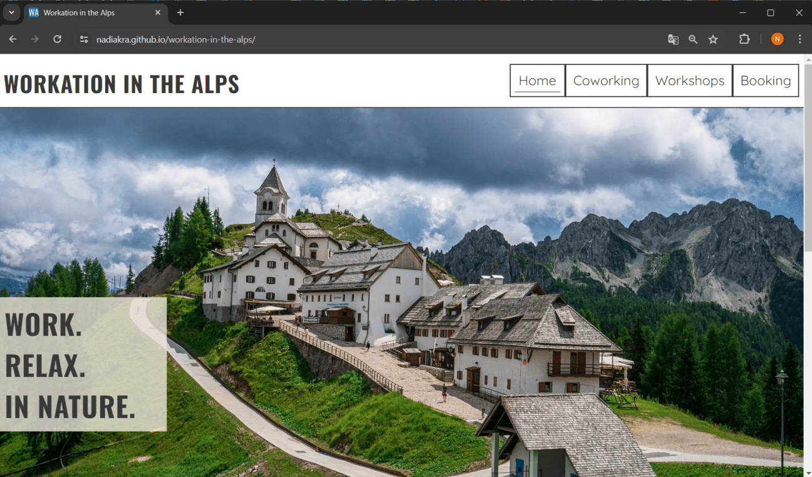

  - Firefox
  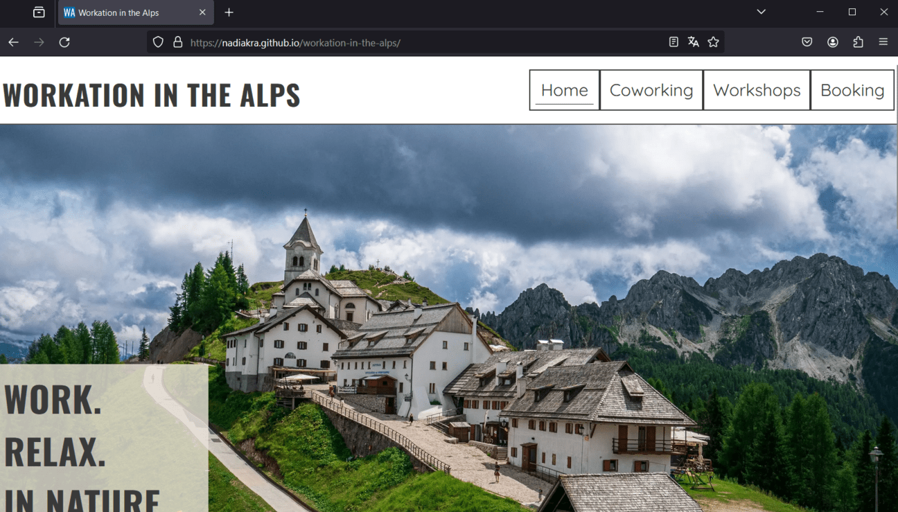

  - Safari
  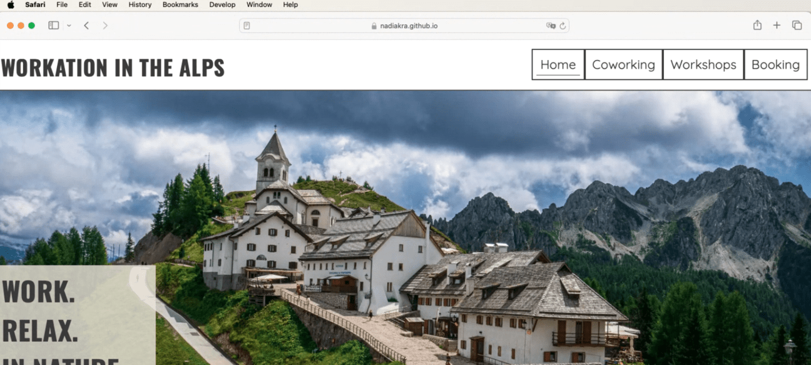

- In order to test the correct __responsiveness__ by devtools in Chrome and Firefox. In addition __all the pages (Homepage, Coworking, Workshops, Booking and Response)__ checked in all the available screen sizes with the 
  <a href="https://responsivedesignchecker.com/" target="_blank">Responsive Design Checker</a>
  Here are some images to prove the checks:

  - Chrome devtools, page Coworking, mobile: 

  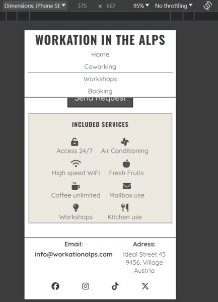
  
  - Responsive Design Checker, page Booking, tablet: 

  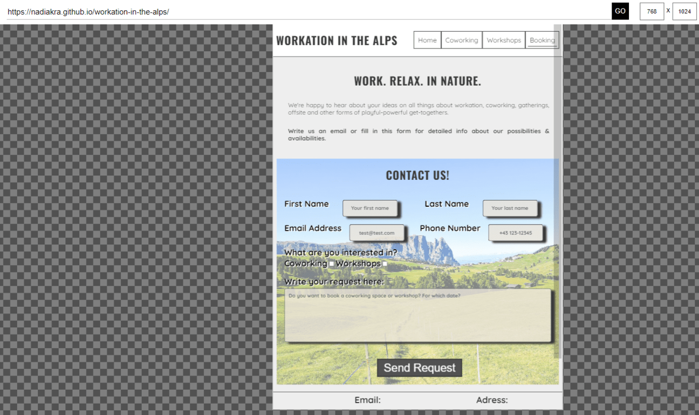

  - Responsive Design Checker, page Workshops, desktop: 

  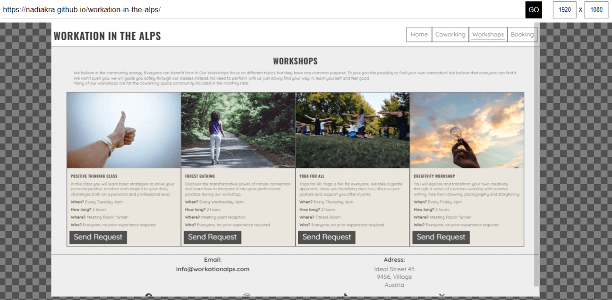

### Manual Testing

| Feature | Action | Expected result | Tested | Passed | Comments |
| ------- | ------ | --------------- | ------ | ------ | -------- |
| __NavBar__ |
| Home | click on "Home" link | User is redirected to the Home page | yes | yes | - |
| Coworking | click on "Coworking" link | User is redirected to the Coworking page | yes | yes | - |
| Workshops | click on "Workshops" link | User is redirected to the Workshops page | yes | yes | - |
| Booking | click on "Booking" link | User is redirected to the Booking page | yes | yes | - |
| __Footer__ |
| Email | click on "Email" link | User is redirected to email box | yes | yes | Email box opens in a new tab |
| Adress | click on "Adress" link | User is redirected to Google Maps | yes | yes | Google Maps opens in a new tab |
| Facebook icon | click on the Facebook icon | User is redirected to the Facebook page | yes | yes | Facebook opens in a new tab |
| Instagram icon | click on the Instagram icon | User is redirected to the Instagram page | yes | yes | Instagram opens in a new tab |
| TikTok icon | click on the TikTok icon | User is redirected to the TikTok page | yes | yes | TikTok opens in a new tab |
| X-Twitter icon | click on the X-Twitter icon | User is redirected to the X-Twitter page | yes | yes | X-Twitter opens in a new tab |
| __Coworking__ |
| "Send Request" Button | click on the "Send Request" button | User is redirected to the Booking page | yes | yes | - |
| __Workshops__ |
| "Send Request" Button | click on the "Send Request" button | User is redirected to the Booking page | yes | yes | all the buttons in the section have the same functionality |
| __Booking__ |
| First Name Input | Enter First Name | User has entered the First Name | yes | yes | If First Name is missing, message error will appear by clicking on send request |
| Last Name Input | Enter Last Name | User has entered the Last Name | yes | yes | If Last Name is missing, message error will appear by clicking on send request |
| Email Adress Input | Enter Email Adress | User has entered the Email Adress| yes | yes | If Email Adress is missing or not correctly written, message error will appear by clicking on send request.|
| Phone Number Input | Enter Phone Number | User has entered the Phone Number | yes | yes | - |
| Coworking or Workshop Checkbox | Click on Coworking or Workshop | User has checked the field if applicable | yes | yes | - |
| Textarea Input | Enter the request in the Textarea | User has written the request | yes | yes | If text in the Textarea is missing, message error will appear by clicking on send request |
| "Send Request" Button | click on the "Send Request" button | User is redirected to the Response page | yes | yes | - |

### Validator Testing 

- __HTML__
No errors were returned when passing through the official [W3C validator](https://validator.w3.org/#validate_by_uri)

  - __Home Page__

  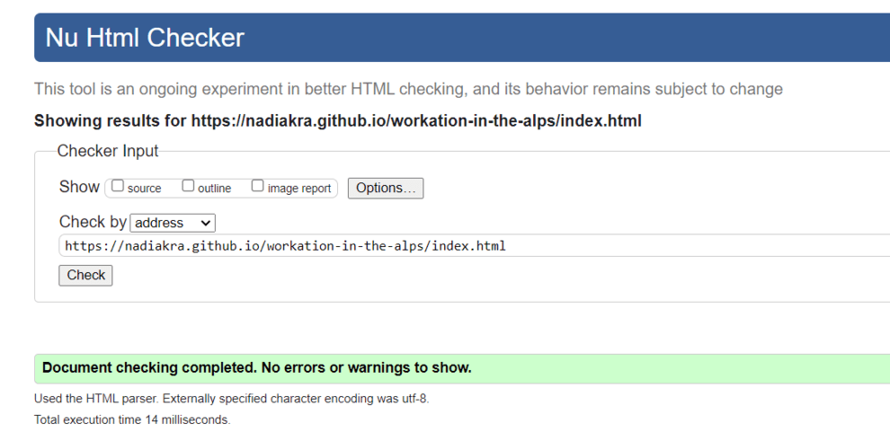

  - __Coworking Page__

  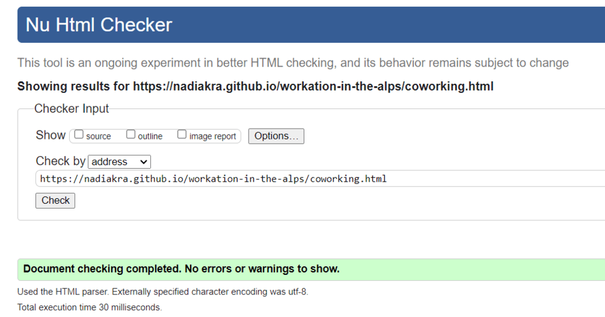

  - __Workshops Page__

  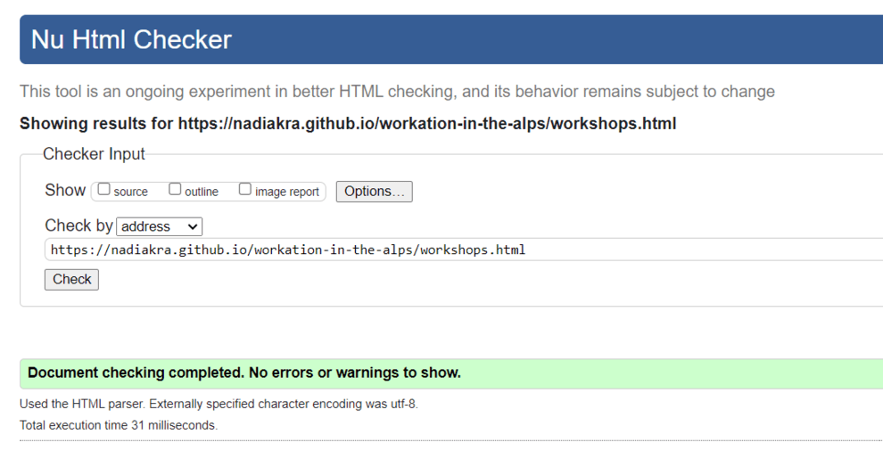

  - __Booking Page__

  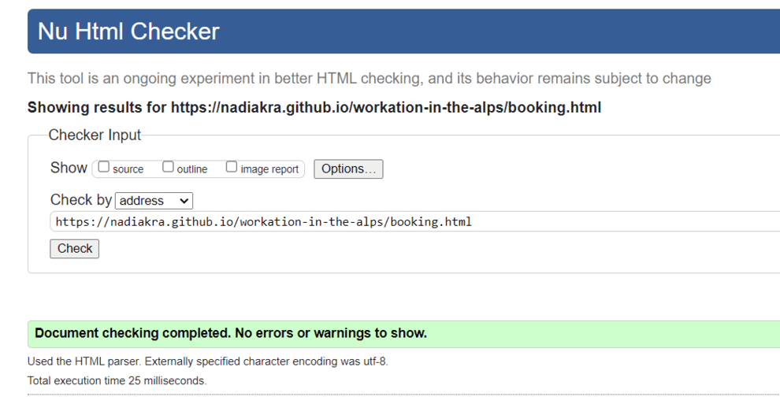

  - __Response Page__

  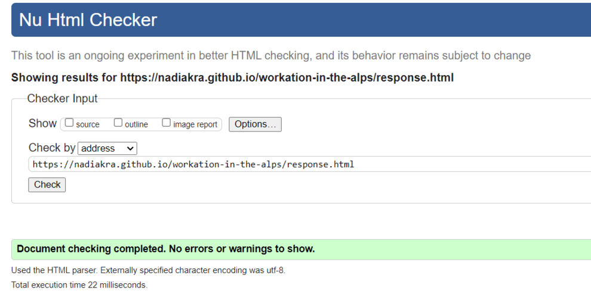

- __CSS__
  - No errors were found when passing through the official [(Jigsaw) validator](https://jigsaw.w3.org/css-validator/#validate_by_uri)

  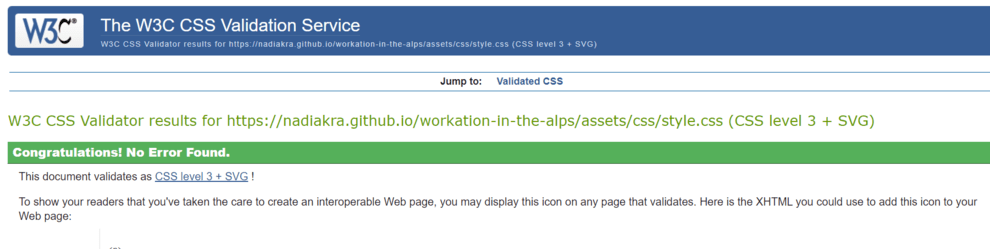

### Lighthouse Report
The Lightouse Tool has tested the accessibility and performance of each page.

 - __Home Page__

  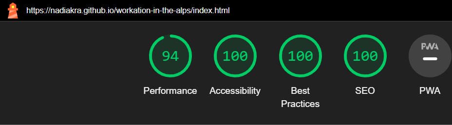

  - __Coworking Page__

  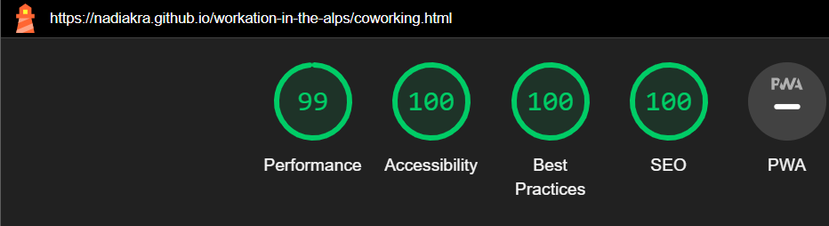

  - __Workshops Page__

  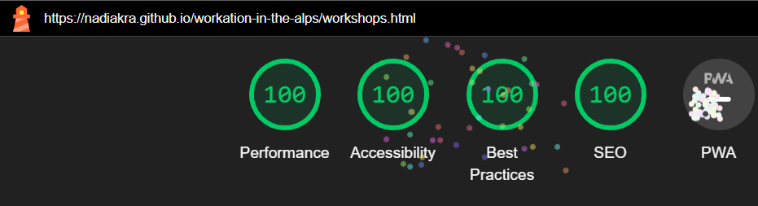

  - __Booking Page__

  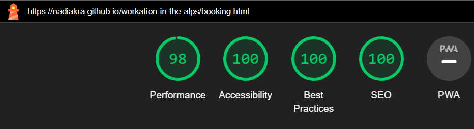

  - __Response Page__

  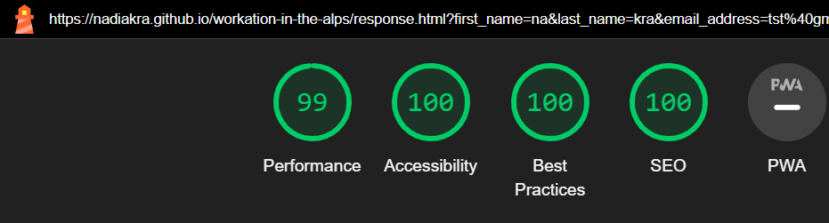

### Bugs

You will need to mention unfixed bugs and why they were not fixed. This section should include shortcomings of the frameworks or technologies used. Although time can be a big variable to consider, paucity of time and difficulty understanding implementation is not a valid reason to leave bugs unfixed. 

## Deployment

- The site was deployed to GitHub pages. The steps to deploy are as follows: 
  - In the GitHub repository, navigate to the Settings tab 
  - From the source section drop-down menu, select the __Main Branch__ and click "save".
  - Once the master branch has been selected, the page will be automatically refreshed with a detailed ribbon display to indicate the successful deployment. 

The live link can be found here: <a href="https://nadiakra.github.io/workation-in-the-alps/" target="_blank">Workation in the Alps</a>

## Credits 

In this section you need to reference where you got your content, media and extra help from. It is common practice to use code from other repositories and tutorials, however, it is important to be very specific about these sources to avoid plagiarism. 

You can break the credits section up into Content and Media, depending on what you have included in your project. 

### Content 

- The text for the Home page was taken from Wikipedia Article A
- Instructions on how to implement form validation on the Sign Up page was taken from [Specific YouTube Tutorial](https://www.youtube.com/)
- The icons in the footer were taken from [Font Awesome](https://fontawesome.com/)

### Media

- The photos used on the home and sign up page are from This Open Source site
- The images used for the gallery page were taken from this other open source site

