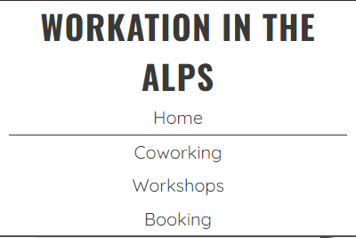
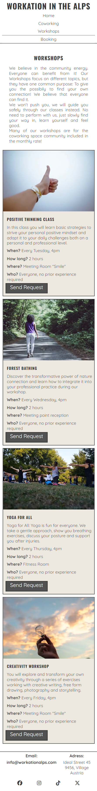

# Workation in the Alps

Workation in the Alps is a website that wants to offer the possibility for remote workers and entire teams to have all the infrastructure needed to work and at the same this to relax, find the balance and let creativity flowing. Starting from the home page of the Work in the Alps site users have the possibility to understand the concept of the workation village and get some visual impressions about the place. At any time the users can switch to other pages to get more information about the coworking od workshops offer or switch directly to the booking form.

The site can be reached by this <a href="https://nadiakra.github.io/workation-in-the-alps/" target="_blank">link.</a> 

## User Stories

### First Time Visitor Goals
- As a First Time Visitor, I want to easily understand the main purpose of the site and learn more about the company and offered packages.
- As a First Time Visitor, I want to have easy access to the content and through a well-structured site.
- As a First Time Visitor, I want to see images of the location to have a visual overview about the place.

### Returning Visitor Goals
- As a Returning Visitor, I want to see information about workshops and coworking packages offered.
- As a Returning Visitor, I want to get more details about the single products.
- As a Returnig Visitor, I want to have a possibility to get in contact with the company to send a request for a coworking place or workshop.

### Frequent Visitor Goals
- As a Frequent Visitor, I want to have the possibility to ask particular questions regarding coworking and workshops.
- As a Frequent Visitor, I want to see if there are changes in the offered packages.

## Features 

The website "Workaktion in the Alps" has multiple features, in this section I provide an overview about each feature and its fuctionality. The two features "Navigation Bar" and "Footer" look the same way on all the pages. The site has 4 main pages: Home page, Coworking page, Workshops page and the Booking page. With this 4 pages structure the user has the possibility to gain directly from the first landing paage all the information about what kind of information and action possibilities the website is providing. 
The last page called "Response" contains the response message, that user receive once sending the request form.

### Existing Features

- __Navigation Bar__

  - Features the pages "Home", "Coworking", "Workshops" and "Booking", the full responsive navigation bar includes links to the logo and to every single page.
  - This sections provides the user the possibility to change the page without the need to go back to the home page and to filter interesting information.
  - "Home" was added to the NavBar in a second moment to improve user experience, as otherwise user would not know how to come back to the home page while navigating in one of the other pages.
  - The first image shows the NavBar for small screens and the second the NavBar for larger screens from 768px.

 

 

- __Home page image__

  - The home page image is the workation village and will include also the claim "Work. Relax. In Nature" to communicate in a few words the philosopy of this place.
  - The user will have the possibliity to have the most of the image element as the claim box adapts the dimenson when screens become larger.
  - This section should give the user a visual impression of the village and its uniqueness combination of work and nature. The goal is to gain the interest of the user, who wants at this point more information.

- __About us Section__

  - The About Us section will provide information about the background and the story behind the the concept of Workation in the Alps. 
  - The user will gain from the first moment the sense of community that should convice the user to choose this village as the next remote working place.  

- __Gallery Section__

  - This section will highlight with pictures want the user has to aspect on site if booking. The attractive images should give a positive feeling to the user.
  - The pictures are fully responsive and it is planned to change them regularly at least twice a year to have seasonal relevant pictures.
  - The heading is not visible thanks to the display-none property in css, but reachable for seo reasons.

- __The Footer__ 

  - The footer section will include the email contact information, the adress and the relevant social media links. All the links will open to a new tab to allow easy navigation for the user. 
  - The user gains in this section all the valuable information to get in touch and find the geographical position of the village and to stay in touch through social media. 
  - The footer will have a top-border to visualise the end of the main content.

- __Coworking Page__

  - In this page the user will gain an overview about the prices and packages as well as the services included.
  - The image is an important element as the user can visualize how the working place looks like.
  - The user will quickly understand the information provided thanks to the simple page structure and will have the possibility to send directly a request. The send request button will bring the user directly to the booking form page.

- __Workshops Page__

  - In this page the user will see the offered workshop classes and will gain an overview about how they are structured.
  - After each workshop description the user will have the possibility to click on the request button that redirects to the booking page.
  - The user will have all information in a simple structured form.

- __Booking Page__

  - This page will allow the user to send general requests. The user will be able specify if interested in "Coworking" or "Workshops" or both. The user will be asked to submit at least the full name, an email adress and a text regarding the request. 
  - Placeholder text will guide the user to fill the form correctly and avoid missunderstandings.

- __Response Page__

  - This page appears after submitting the contact form. 
  - The user receives a thank you for submitting message with the advice that the team will come back to the request as soon as possible.

### Features Left to Implement

- To make the main page more attractive the next implementation will be a video instead of the static picture to add value to the first impression.
- The Booking Page will have in the next implementation date fields in order to give the user the possibility to add directly the wished period of stay. 

## Design
### Colour Scheme

The design used is based on neutral colours. As the site includes many images with different colour paths the user's attention should not be losed by a colour overload. 

- HEX colours #393939, #515151 and #000000 are used for text design
- HEX colours #FFFFFF and #E9E3D9 are used for backgrounds. #E9E3D9 is used in the RBGA form with its transparency property.

### Typhography

To select the font the platform <a href="https://www.fontpair.co/all" target="_blank">Fontpair</a> was consulted.

- Oswald Google Font was used to make headings catchy and increase the attractiveness of the site.
- Quicksand Google Font was used as the main font of the site to assure the easy readibility of the content in the site.

### Wireframes

__Mobile Devices__
- [Home Page, Mobile Screen](./assets/images/screenshot-wireframe-home-mobile.png)
- [Coworking Page, Mobile Screen](./assets/images/screenshot-wireframe-coworking-mobile.png)
- [Workshops Page, Mobile Screen](./assets/images/screenshot-wireframe-workshops-mobile.png)
- [Booking Page, Mobile Screen](./assets/images/screenshot-wireframe-booking-mobile.png)
- [Response Page, Mobile Screen](./assets/images/screenshot-wireframe-response-mobile.png)

__Tablets__
- [Home Page, Tablet Screen](./assets/images/screenshot-wireframe-home-tablet.png)
- [Coworking Page, Tablet Screen](./assets/images/screenshot-wireframe-coworking-tablet.png)
- [Workshops Page, Tablet Screen](./assets/images/screenshot-wireframe-workshops-tablet.png)
- [Booking Page, Tablet Screen](./assets/images/screenshot-wireframe-booking-tablet.png)
- [Response Page, Tablet Screen](./assets/images/screenshot-wireframe-response-tablet.png)

__Laptops and bigger__
- [Home Page, Laptop Screen](./assets/images/screenshot-wireframe-home-laptop.png)
- [Coworking Page, Laptop Screen](./assets/images/screenshot-wireframe-coworking-laptop.png)
- [Workshops Page, Laptop Screen](./assets/images/screenshot-wireframe-workshops-laptop.png)
- [Booking Page, Laptop Screen](./assets/images/screenshot-wireframe-booking-laptop.png)
- [Response Page, Laptop Screen](./assets/images/screenshot-wireframe-response-laptop.png)

## Technology Used

- <a href="https://developer.mozilla.org/en-US/docs/Web/HTML" target="_blank">HTML</a> was used as the base of the site.
- <a href="https://developer.mozilla.org/en-US/docs/Web/CSS" target="_blank">CSS</a> was used to style and add layouts to the site.
- <a href="https://developer.mozilla.org/en-US/docs/Learn/CSS/CSS_layout/Flexbox" target="_blank">CSS Flexbox</a> was used to arrange items on the pages.
- <a href="https://www.gitpod.io/" target="_blank">Gitpod</a> was used to develop the website.
- <a href="https://github.com/" target="_blank">Github</a> was used to host the website.
- <a href="https://pages.github.com/" target="_blank">Github Pages</a> was used to deploy the website.
- <a href="https://imageresizer.com/" target="_blank">Imageresizer</a> was used to rezise images for the website and the READ.ME document.
- <a href="https://cloudconvert.com/webp-converter" target="_blank">WEBP Converter</a> was used to convert images for the webpage to WEBP.
- <a href="https://favicon.io/favicon-generator/" target="_blank">FavIcon Generator</a> was used to create the FavIcon for the site.

## Deployment

### Deployment to GitHub Pages

- The site was deployed to GitHub Pages. The steps to deploy are as follows: 
  - In the GitHub repository, navigate to the Settings tab 
  - From the source section drop-down menu, select the __Main Branch__ and click "save".
  - Once the master branch has been selected, the page will be automatically refreshed with a detailed ribbon display to indicate the successful deployment. 

The live link can be found here: <a href="https://nadiakra.github.io/workation-in-the-alps/" target="_blank">Workation in the Alps</a>

### Local Deployment

To make a local copy of the "Workation in the Alps" project, there is the possibility to clone the repository by typing the following command in the IDE terminal:
- `git clone https://github.com/NadiaKra/workation-in-the-alps.git`

## Testing 

### Compatability and Responsiveness

- In order to test the correct __compatability__ the website was tested on following browser:
  - Chrome
  

  - Firefox
  

  - Safari
  

- In order to test the correct __responsiveness__ devtools in Chrome and Firefox were used. In addition __all the pages (Homepage, Coworking, Workshops, Booking and Response)__ were checked in all the available screen sizes with the 
  <a href="https://responsivedesignchecker.com/" target="_blank">Responsive Design Checker</a> and full page screenshot with the Chrome Extension <a href="https://gofullpage.com/" target="_blank">Go Full Page</a>
  Here are some images to prove the checks:

  - __Home page__
  
    - Small screen, Iphone SE, 375x667:  

    
  
    - Middle screen, Ipad Mini, 768x1024: 

    

    - Large screen, Laptop, 1920x1080: 

    

  - __Coworking page__
  
    - Small screen, Iphone SE, 375x667:  

    
  
    - Middle screen, Ipad Mini, 768x1024: 

    

    - Large screen, Laptop, 1920x1080: 
    
    

  - __Workshops page__
  
    - Small screen, Iphone SE, 375x667:  

    
  
    - Middle screen, Ipad Mini, 768x1024: 

    

    - Large screen, Laptop, 1920x1080: 
    
    

  - __Booking page__
  
    - Small screen, Iphone SE, 375x667:  

    
  
    - Middle screen, Ipad Mini, 768x1024: 

    

    - Large screen, Laptop, 1920x1080: 
    
      

  - __Request page__
  
    - Small screen, Iphone SE, 375x667:  

    
  
    - Middle screen, Ipad Mini, 768x1024: 

    

    - Large screen, Laptop, 1920x1080: 
    
     

### Manual Testing

| Feature | Action | Expected result | Tested | Passed | Comments |
| ------- | ------ | --------------- | ------ | ------ | -------- |
| __NavBar__ |
| Home | click on "Home" link | User is redirected to the Home page | yes | yes | - |
| Coworking | click on "Coworking" link | User is redirected to the Coworking page | yes | yes | - |
| Workshops | click on "Workshops" link | User is redirected to the Workshops page | yes | yes | - |
| Booking | click on "Booking" link | User is redirected to the Booking page | yes | yes | - |
| __Footer__ |
| Email | click on "Email" link | User is redirected to email box | yes | yes | Email box opens in a new tab |
| Adress | click on "Adress" link | User is redirected to Google Maps | yes | yes | Google Maps opens in a new tab |
| Facebook icon | click on the Facebook icon | User is redirected to the Facebook page | yes | yes | Facebook opens in a new tab |
| Instagram icon | click on the Instagram icon | User is redirected to the Instagram page | yes | yes | Instagram opens in a new tab |
| TikTok icon | click on the TikTok icon | User is redirected to the TikTok page | yes | yes | TikTok opens in a new tab |
| X-Twitter icon | click on the X-Twitter icon | User is redirected to the X-Twitter page | yes | yes | X-Twitter opens in a new tab |
| __Coworking__ |
| "Send Request" Button | click on the "Send Request" button | User is redirected to the Booking page | yes | yes | - |
| __Workshops__ |
| "Send Request" Button | click on the "Send Request" button | User is redirected to the Booking page | yes | yes | all the buttons in the section have the same functionality |
| __Booking__ |
| First Name Input | Enter First Name | User has entered the First Name | yes | yes | If First Name is missing, message error will appear by clicking on send request |
| Last Name Input | Enter Last Name | User has entered the Last Name | yes | yes | If Last Name is missing, message error will appear by clicking on send request |
| Email Adress Input | Enter Email Adress | User has entered the Email Adress| yes | yes | If Email Adress is missing or not correctly written, message error will appear by clicking on send request.|
| Phone Number Input | Enter Phone Number | User has entered the Phone Number | yes | yes | - |
| Coworking or Workshop Checkbox | Click on Coworking or Workshop | User has checked the field if applicable | yes | yes | - |
| Textarea Input | Enter the request in the Textarea | User has written the request | yes | yes | If text in the Textarea is missing, message error will appear by clicking on send request |
| "Send Request" Button | click on the "Send Request" button | User is redirected to the Response page | yes | yes | - |

### Validator Testing 

- __HTML__
No errors were returned when passing through the official [W3C validator](https://validator.w3.org/#validate_by_uri)

  - __Home Page__

  

  - __Coworking Page__

  

  - __Workshops Page__

  

  - __Booking Page__

  

  - __Response Page__

  

- __CSS__
  - No errors were found when passing through the official [(Jigsaw) validator](https://jigsaw.w3.org/css-validator/#validate_by_uri)

  

### Lighthouse Report
The Lightouse Tool has tested the accessibility and performance of each page.

 - __Home Page__

  

  - __Coworking Page__

  

  - __Workshops Page__

  

  - __Booking Page__

  

  - __Response Page__

  

### Bugs

- __Solved Bugs__
  - Home page main picture overlaps header when scrolling down --> Solution: add z-index to header.
  - Photos in section gallery overflow the main --> Solution: add property overflow an set it to auto.
  - Photos in section gallery in the media query from 992px are not on one raw --> Solution: resize images in the media query.
  - Heading in section gallery is missing --> Solution: add heading in HTML and set to to hidden in css.
  - With small screens until width 339 the header overflows the main section --> add new media query and adapt the margin-top property for main.
  - Send request button in coworking and workshops sections were at the beginning a button element with an "a href" element inside, this was wrong --> Solution delete button element, add role to "a href" element and set it to button.

- __Unsolved Bugs__
  - None.

### Mistakes and Lessons Learned

At the beginning of the project were some mistakes done in setting the first css properties along the parent-descendent rule. I have learned to use different background colors for header, main, body and footer in the very first stage of the development to better understand how the different elements are working with the defined css properties. Another mistake at the beginning was the lack of structure as I didn't use Flexbox properties properly. I have learned during the project the importance of CSS structure.

## Credits 

__Content__

- Inspiration for the text and the home page came from [The Workation Village](https://www.theworkationvillage.com/)
- Inspiration for Font Pairing came from [Fontpair](https://www.fontpair.co/all)
- The icons in the footer and in the section "Coworking" were taken from [Font Awesome](https://fontawesome.com/)

__Media__

All the images present on the website are from this open source site [Pexel](https://www.pexels.com/).

- __Home Page__, Section "home-image":
  - Image 1: [Link to the Image on Pexel](https://www.pexels.com/photo/village-at-monte-lussari-in-alps-17942574/)
- __Home Page__, Section "gallery":
  - Image 2: [Link to the Image on Pexel](https://www.pexels.com/photo/photography-of-a-woman-meditating-906097/)
  - Image 3: [Link to the Image on Pexel](https://www.pexels.com/photo/three-woman-sitting-on-white-chair-in-front-of-table-2041627/)
  - Image 4: [Link to the Image on Pexel](https://www.pexels.com/photo/bedroom-interior-setup-271624/)

- __Coworking page__
  - Image 5: [Link to the Image on Pexel](https://www.pexels.com/photo/black-office-rolling-chair-beside-white-wooden-table-3712597/)

- __Workshops page__
  - Image 6: [Link to the Image on Pexel](https://www.pexels.com/photo/person-doing-thumbs-up-193821/)
  - Image 7: [Link to the Image on Pexel](https://www.pexels.com/photo/woman-in-heels-walking-on-concrete-road-surrounded-with-tall-and-green-trees-2953581/)
  - Image 8: [Link to the Image on Pexel](https://www.pexels.com/photo/women-performing-yoga-on-green-grass-near-trees-1472887/)
  - Image 9: [Link to the Image on Pexel](https://www.pexels.com/photo/person-holding-clear-light-bulb-1314410/)

- __Booking and Response page__
  - Image 10: [Link to the Image on Pexel](https://www.pexels.com/photo/path-on-alpine-meadow-19124747/)

__FavIcon__

  - The FavIcon were created on [FavIcon Generator](https://favicon.io/favicon-generator/)

## Acknowledgements
- [Iuliia Konovalova](https://github.com/IuliiaKonovalova), my mentor for the professional way of supporting. She guided me during my very first deployed project showing me the direction without telling the solution, giving me the possibility to grow and gain experience.
- [Code Institue](https://codeinstitute.net/global/) Tutors for their support.
