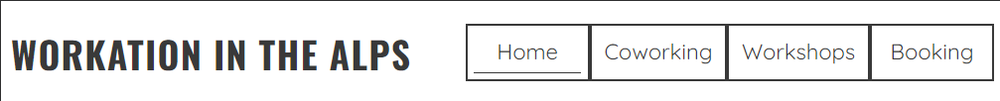
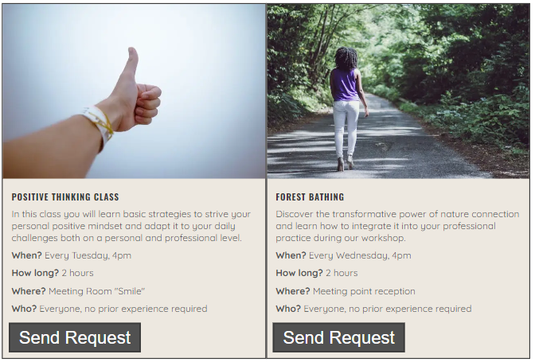

# Workation in the Alps

Workation in the Alps is a website that wants to offer the possibility for remote workers and entire teams to have all the infrastructure needed to work and at the same this to relax, find the balance and let creativity flowing. Starting from the home page of the Work in the Alps site users have the possibility to understand the concept of the workation village and get some visual impressions about the place. At any time the users can switch to other pages to get more information about the coworking od workshops offer or switch directly to the booking form.

## Features 

The website "Workaktion in the Alps" has multiple features, in this section I provide an overview about each feature and its fuctionality. The two features "Navigation Bar" and "Footer" look the same way on all the pages. The site has 4 pages: Home page, Coworking page, Workshops page and the Booking page. With this 4 pages structure the user has the possibility to gain directly from the first landing paage all the information about what kind of information and action possibilities the website is providing.

### Existing Features

- __Navigation Bar__

  - Features the pages "Workation in the Alps" "Coworking", "Workshops" and "Booking", the full responsive navigation bar includes links to the logo and to every single page.
  - This sections provides the user the possibility to change the page without the need to go back to the home page and to filter interesting information.
  - The first image shows the NavBar for small screens and the second the NavBar for larger screens from 768px.

 

 

- __Home page image__

  - The home page image is the workation village and will include also the claim "Work. Relax. In Nature" to communicate in a few words the philosopy of this place.
  - The user will have the possibliity to have the most of the image element as the claim box adapts the dimenson when screens become larger.
  - This section should give the user a visual impression of the village and its uniqueness combination of work and nature. The goal is to gain the interest of the user, who wants at this point more information.

- __About us Section__

  - The About Us section will provide information about the background and the story behind the the concept of Workation in the Alps. 
  - The user will gain from the first moment the sense of community that should convice the user to choose this village as the next remote working place.  

- __Gallery Section__

  - This section will highlight with pictures want the user has to aspect on site if booking. The attractive images should give a positive feeling to the user.
  - The pictures are fully responsive and it is planned to change them regularly at least twice a year to have seasonal relevant pictures.

- __The Footer__ 

  - The footer section will include the email contact information, the adress and the relevant social media links. All the links will open to a new tab to allow easy navigation for the user. 
  - The user gains in this section all the valuable information to get in touch and find the geographical position of the village and to stay in touch through social media. 
  - The footer will have a top-border to visualise the end of the main content.

- __Coworking Page__

  - In this page the user will gain an overview about the prices and packages as well as the services included.
  - The image is an important element as the user can visualize how the working place looks like.
  - The user will quickly understand the information provided thanks to the simple page structure and will have the possibility to send directly a request. The send request button will bring the user directly to the booking form page.

- __Workshops Page__

  - In this page the user will see the offered workshop classes and will gain an overview about how they are structured.
  - After each workshop description the user will have the possibility to click on the request button that redirects to the booking page.
  - The user will have all information in a simple structured form.

- __Booking Page__

  - This page will allow the user to get signed up to Love Running to start their running journey with the community. The user will be able specify if they would like to take part in road, trail or both types of running. The user will be asked to submit their full name and email address. 

For some/all of your features, you may choose to reference the specific project files that implement them.

In addition, you may also use this section to discuss plans for additional features to be implemented in the future:

### Features Left to Implement

- Another feature idea

## Testing 

In this section, you need to convince the assessor that you have conducted enough testing to legitimately believe that the site works well. Essentially, in this part you will want to go over all of your project’s features and ensure that they all work as intended, with the project providing an easy and straightforward way for the users to achieve their goals.

In addition, you should mention in this section how your project looks and works on different browsers and screen sizes.

You should also mention in this section any interesting bugs or problems you discovered during your testing, even if you haven't addressed them yet.

If this section grows too long, you may want to split it off into a separate file and link to it from here.

### Validator Testing 

- HTML
  - No errors were returned when passing through the official [W3C validator](https://validator.w3.org/nu/?doc=https%3A%2F%2Fcode-institute-org.github.io%2Flove-running-2.0%2Findex.html)
- CSS
  - No errors were found when passing through the official [(Jigsaw) validator](https://jigsaw.w3.org/css-validator/validator?uri=https%3A%2F%2Fvalidator.w3.org%2Fnu%2F%3Fdoc%3Dhttps%253A%252F%252Fcode-institute-org.github.io%252Flove-running-2.0%252Findex.html&profile=css3svg&usermedium=all&warning=1&vextwarning=&lang=en#css)

### Unfixed Bugs

You will need to mention unfixed bugs and why they were not fixed. This section should include shortcomings of the frameworks or technologies used. Although time can be a big variable to consider, paucity of time and difficulty understanding implementation is not a valid reason to leave bugs unfixed. 

## Deployment

This section should describe the process you went through to deploy the project to a hosting platform (e.g. GitHub) 

- The site was deployed to GitHub pages. The steps to deploy are as follows: 
  - In the GitHub repository, navigate to the Settings tab 
  - From the source section drop-down menu, select the Master Branch
  - Once the master branch has been selected, the page will be automatically refreshed with a detailed ribbon display to indicate the successful deployment. 

The live link can be found here - https://code-institute-org.github.io/love-running-2.0/index.html 

## Credits 

In this section you need to reference where you got your content, media and extra help from. It is common practice to use code from other repositories and tutorials, however, it is important to be very specific about these sources to avoid plagiarism. 

You can break the credits section up into Content and Media, depending on what you have included in your project. 

### Content 

- The text for the Home page was taken from Wikipedia Article A
- Instructions on how to implement form validation on the Sign Up page was taken from [Specific YouTube Tutorial](https://www.youtube.com/)
- The icons in the footer were taken from [Font Awesome](https://fontawesome.com/)

### Media

- The photos used on the home and sign up page are from This Open Source site
- The images used for the gallery page were taken from this other open source site

Congratulations on completing your Readme, you have made another big stride in the direction of being a developer! 

## Other General Project Advice

Below you will find a couple of extra tips that may be helpful when completing your project. Remember that each of these projects will become part of your final portfolio so it’s important to allow enough time to showcase your best work! 

- One of the most basic elements of keeping a healthy commit history is with the commit message. When getting started with your project, read through [this article](https://chris.beams.io/posts/git-commit/) by Chris Beams on How to Write  a Git Commit Message 
  - Make sure to keep the messages in the imperative mood 

- When naming the files in your project directory, make sure to consider meaningful naming of files, point to specific names and sections of content.
  - For example, instead of naming an image used ‘image1.png’ consider naming it ‘landing_page_img.png’. This will ensure that there are clear file paths kept. 

- Do some extra research on good and bad coding practices, there are a handful of useful articles to read, consider reviewing the following list when getting started:
  - [Writing Your Best Code](https://learn.shayhowe.com/html-css/writing-your-best-code/)
  - [HTML & CSS Coding Best Practices](https://medium.com/@inceptiondj.info/html-css-coding-best-practice-fadb9870a00f)
  - [Google HTML/CSS Style Guide](https://google.github.io/styleguide/htmlcssguide.html#General)

Getting started with your Portfolio Projects can be daunting, planning your project can make it a lot easier to tackle, take small steps to reach the final outcome and enjoy the process! 

